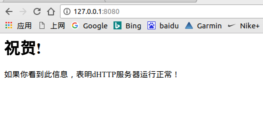

# networkprogramming
some practice about linux network programming
## run
	cd shttpd/Debug
    ./shttpd
    
    //然后浏览器里面输入127.0.0.1:8080就可以看到一句结果
    //表明运行正常
    ctrl+c//结束服务器
<strong>效果如下：<strong>     
